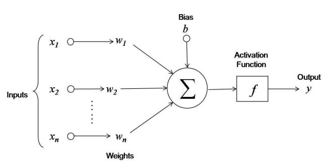
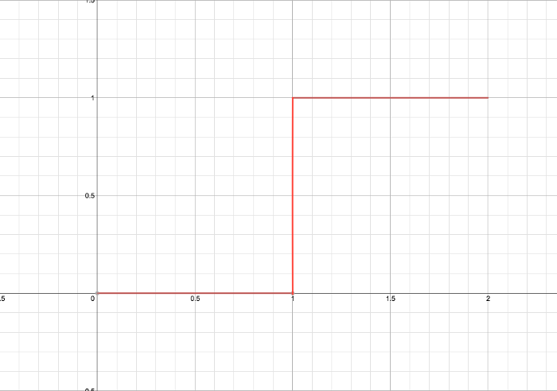
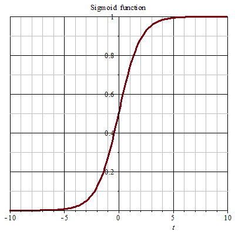

The other day I had been looking up information on [machine learning](http://en.wikipedia.org/wiki/Machine_learning). I'm new to some of the topics in this field but I have been introduced to some before. I've always wanted to learn more. The idea of teaching a computer how to "learn" just seems intriguing to me.

Specifically I had been researching [neural networks](http://en.wikipedia.org/wiki/Artificial_neural_network). They are useful because they can help uncover hidden patterns in a plethora of data, or be taught to perform certain tasks such as handwriting or facial recognition. 

I had watched an [MIT OpenCourseWare Lecture](https://www.youtube.com/watch?v=q0pm3BrIUFo) which gave a rough introduction to neural networks which I found to be quite captivating. I found it so fantastic actually that I wanted to share the basic concepts here. For the purpose of this post, I'm going to assume that we're teaching this neural net via supervised learning. 

Or, in other words, we are going to make this neural network learn by giving it a set of "correct" input and output values, which it will use to calibrate, or change its own structure to make sure that it also outputs the correct values. Now let's dive in!

To explain briefly, neural networks are modeled after the same neurons that exist in our brain. 

For our purpose we focus on only a few of the main features of a neuron which are critical to our model for a neural network.

The main parts of the neuron we want to focus on are:

- Dendrites
- The Axon
- The Axon Terminals

**The dendrites** are small tree-like structures that are stimulated when enough neurotransmitters are dumped into the synapse between a neuron and the end of the dendrite. Some of these dendrites might be easier to stimulate than other based on various factors 

**The axon** is the lengthy part of the neuron which simply propagates a "spike" of energy to the axon terminals, which originates from the dendrites.

**The axon terminals** dump neurotransmitters into the synapse to help stimulate the dendrites of the next neuron.

If there are enough neurotransmitters dumped into the synapse, It will stimulate the next neuron's dendrites, sending a spike of "excitement" or "energy" to the next neuron, and so forth. At each end of the axom terminals there is another neuron's dendrites separated by a space called the **synapse**. If a neuron is stimulated, it will dump neurotransmitters into the synapse. 

This is a gross simplification of a neuron, but for the model of a neural network and the backpropagation algorithm, we don't need to understand more than this.

#### Modeling the Neuron
------------------

First, notice the inputs. Each input from $$ x_1 $$ to $$ x_n $$ is given as an input to the neuron. Each of the inputs is multiplied by a weight $$ w $$ corresponding to an input before being summed into the function.

The neuron also has a bias, labeled  $$ b $$ in the diagram, which I like to call $$ w_0 $$. We can think of this bias as a given input to each neuron that always has a value of -1. The weight of the bias input $$ w_0 $$ can be adjusted accordingly.

Think of this part as the neurotransmitters being the inputs multiplied by the weights which stimulate the dendrites of the neuron.

From here we can represent the total stimulus as the sum of each input multiplied by a corresponding weight.

$$
-w_0 + \sum_{i=1}^{n}x_iw_i
$$

The value of this will be then be passed onto the activation, or *threshold* function. The threshold function might be best viewed as a single-step function, where say once the input $$ \alpha $$ reaches a certain value, it will output a certain value. We're going to keep this to ones and zeros.

Next, once the threshold is activated or not, we will get an output from this neuron. Once we run this neural network through for the first time, we are going to need to find out how good (or bad) the neural network did at predicting our answer.

Remember how I said that the neural network is given a set of "correct" inputs and outputs to learn from? Well here's where that comes into play.

Let's say that our output of the neural net is $$ y $$ and our desired or *correct* output is going to be assigned to $$ d $$. We are going to need a function to test our performance of the neural network. 

Let's call this function $$ P $$. Also, for simplicity's sake, and because this is *convenient* we're going to make the performance function the following:

$$
P(d, y) = -\frac{1}{2}(d-y)^2
$$

(*You'll see what I mean by convenient later*)

#### Adjusting the Model
------------------------------------------------

So now we've got this model. We have a function to test whether our output is close to what we want it to be. We have a way to add our inputs together. What comes next?

Well, we need to have some way of adjusting the neuron to make sure we get closer to our desired output. But how do we know what to adjust? and by how much? 

We're going to use a method called **gradient descent** (or *ascent* depending on direction). We're going to use some math here.

So we know that our desired outputs $$ d $$ can be given by $$ \overline{d} = g(\overline{x}) $$; where $$ \overline{d} $$ and $$ \overline{x} $$ are our vectors of inputs and desired outputs that our neural network is going to learn from.

The problem is that we don't know what function $$ g $$ is, which is why we're using the neural network to represent it. With the neural networks, we can represent our inputs and outputs by a multivaraite function $$ f $$. This function can be represented by $$ \overline{y} = f(\overline{x}, \overline{w}) $$.

Given these functions, we can see our performance function is now

$$
P(g(\overline{x}), f(\overline{x}, \overline{w})) = -\frac{1}{2}(g(\overline{x})-f(\overline{x}, \overline{w}))^2
$$

We can see from here the performance function is really just a function of the inputs, $$ x $$ and the weights $$ w $$.

Now imagine that we add some complexity to our neural network. We are going make two neural layers *chained* together. That is, we have an input $$ x $$ passed to $$ w_1 $$ passed to a threshold function, who's output is then the input to the next neuron. This is multiplied by another weight $$ w_n $$ which is then passed to the next neuron's threshold. The output of this 2nd threshold will be the output of the neural network.

Just imagine the above diagram of the neural network laid end to end and on top of each other. A general overview can be seen below, where each circle represents a neuron:

This is where things start to become more interesting. Using the algorithm of gradient descent, we can alter the weights $$ \overline{w} $$ by taking the gradient of our performance function with respect to each weight. We can also multiply this gradient by a rate constant, let's say $$ \delta $$, that will determine how much we alter the weights over each iteration.

So let's look at our formula

$$
\triangle w = \delta\nabla_w P = \delta\langle \frac{\partial P}{\partial w_0}, \frac{\partial P}{\partial w_1}, \cdot\cdot\cdot, \frac{\partial P}{\partial w_n} \rangle
$$

This is now telling us that the change in our $$ w $$ over each iteration is going to be equal to $$ \delta $$ multiplied by the partial derivative of $$ P $$ with respect to each weight.

But wait! We have a problem here. We can't just simply take the partial derivative of $$ w $$ with respect to $$ P $$ because $$ w $$ lies within our other function $$ f $$. This means that we are going to need the chain rule.

So this brings up another problem: because we are going to need to take all these derivatives all of the functions in our neural network *must* be differentiable.

So the problem of differentiability lies within our step function. Because a step function is not differentiable we need another function to replace this. Fortunately there is one similar to it that *is* differentiable!

It's called a sigmoid function. You might have seen it before. It has the form

$$
S(\alpha) = \frac{1}{1 + e^{-\alpha}}
$$

The graph of the sigmoid has the following shape:

.

Great! So where do we go from here?

Well, I suggest you watch the [video I linked earlier](https://www.youtube.com/watch?v=q0pm3BrIUFo) if you want a really good understanding of how this works. I will do my best to explain it, but I won't go into explicit detail of how this all works together. The video will explain things more thoroughly.

So if we keep taking our partial derivatives with the chain rule, it turns out that we will need to take the derivative of this sigmoid function.

Turns out this function is actually pretty neat. Let's call the sigmoid function $$ \beta $$. It just so happens, that if you take the derivative of this function *and* we manipulate it a bit, that the derivative of the function turns out to be expressed in terms of the original function itself. I'll let the math do the talking here.

$$
\beta = \frac{1}{1 + e^{-\alpha}}
$$

$$
\frac{d}{d\alpha}(\beta) = (1 + e^{-\alpha})^2 e^{-\alpha}
$$

Then we rearrange our derivative a little bit:

$$
\frac{d}{d\alpha}(\beta) = \beta(1-\beta)
$$

Voila! The derivative of the sigmoid function turns out to be given in terms of the original! I find that to be quite astounding. If you don't believe me you'll just have to take my word for it. I promise you it works. (This is also why I called this function *convenient*).

So now if we do the calculation for each of the partial derivative we get something like. Also, pretend like the value $$ y_n $$ is the respective output for each neuron in the neural network and $$ z $$ is the final output  of the neural net.

The change in weight is then given by

$$
\frac{\partial P}{\partial w_n} = \delta (w_{n+1})(d - z) (\beta(y_n)(1 - \beta(y_n)) (\beta(y_{n-1})(1 - \beta(y_{n-1}))...
$$

#### Wrapping Up
----------------------------

So what does all of this mean?

What this means is that when we are calculating exactly how to adjust the weights in our neural network, the change in each weight depends on a few things.

- The input to the neuron
- The output of the neuron
- The weight of the next neuron.

This helps explain why it's called the backpropagation algorithm. You need to calculate the change in weights at the end of your neural network before you can calculate the change in the beginning. So you work your way back in a wave-like manner, hence the name *backpropagation*.

The other great thing about this algorithm is that the change in weight depends on things you've already calculated, *or* things you're going to have to calculate anyways. It's extremely effecient. There are few, if any, wasted computations.

And that's simply it. The most basic of neural networks and the backpropagation 

-------------------------------------------------

