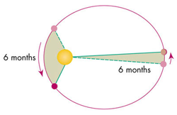
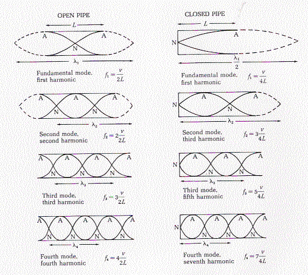
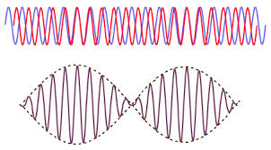
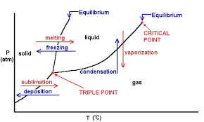
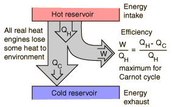
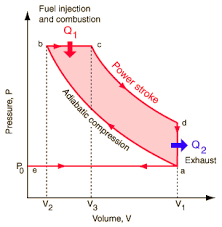
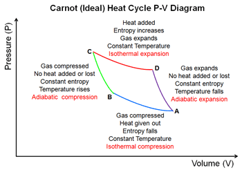

The topics covered in this course are:

- Rotational Dynamics
- Gravitation
- Oscillation and Periodic Motion
- Mechanical Waves
- Sound
- Fluid Mechanics
- Temperature and Heat
- Thermal Properties of Matter
- The First Law of Thermodynamics
- The Second Law Of Thermodynamics

The format of this post will be the following: For each equation I will explain the variables used, the typical units used, and any constant values (if they haven't been defined already). If there are concepts that don't reside within equations, they will be explained nearest to the equations I feel are most related to that concept.

## Rotational Dynamics

##### Torque

> $$ \tau = Fl = I\alpha $$

Torque $$ \tau $$ is equal to the perpendicular force along the moment arm applied a distance, $$ l $$  from a rotational axis.

##### Kinetic Energy of Rolling Body

> $$ KE = \frac{1}{2}mv_{cm}^2 + \frac{1}{2}I\omega^2 $$ 

The total kinetic energy of a body in rolling motion is equal to the sum of the translational kinetic energy and the rotational kinetic energy.

##### Rotational to Translational Velocity

> $$ v_{cm} = R\omega $$

To convert from angular velocity to translational velocity, simply multiply the radius of the object $$ R $$ by the angular velocity.

##### Rotational Work

> $$ W = \tau\Delta\theta $$ 

The angular version of $$ W = Fd $$. A toque multiple by the distance rotated in radians.

##### Power of Rotation

> $$ P = \tau\omega $$ 

The power applied is the angular version of $$ P = Fv $$. Toque, $$ \tau $$ multiplied by the angular velocity, $$ \omega $$.

##### Angular Momentum

> $$ L = I\omega = rmv\cdot sin(\phi) $$ 

Angular momentum is the angular version of normal momentum. It is equal to the moment of inertia multiplied by its angular velocity. This can also be translated to the normal momentum, $$ p = mv $$, multiplied by the velocity at angle $$ \phi $$ from the perpendicular of the 'moment arm' to the object,

##### Conservation of Angular Momentum

> $$ I_1\omega_1 = I_2\omega_2 $$ 

If there is _NO_ net toque applied to an object, the angular momentum in conserved. That is, th $$ L_1 $$ (initial state) should be equal to $$ L_2 $$ (final state).

## Gravitation

##### Gravitational Constant

> $$ G = 6.67 \cdot 10^{-11} $$

This is Newton's constant of gravitation. Used in the equations to follow.

##### Graviational Force of Two Bodies

> $$ F = \frac{GMm}{r^2} $$ 

This equation tells us that two bodies exert the same force on each other based on one objects mass, $$ m $$, the other objects mass, $$ M $$, and the distance between the two objects centers of gravity.

##### Potential Energy of Gravitation

> $$ U = \frac{GMm}{r} $$ 

The potential energy of one body with respect to another.

##### Finding $$ g $$ on Earth and Other Planets

> $$ g = \frac{GM_E}{R_E^2} $$ 

We can find the value for the gravitational acceleration at the surface (or distance from that planet for that matter) so long as we know the planet's mass, $$ M $$, and the distance between the object and the center of the planet, $$ R $$.

##### Circular Orbit Velocity

> $$ v_{orbit} = \sqrt{\frac{GM_E}{R}} $$ 

We can derive this value by setting the values for centripetal force ($$ \frac{mv^2}{r}) $$ equal to $$ \frac{GMm}{r^2} $$. Solving for v, we find that the velocity in a circular orbit depends only on the mass of the planet and the orbit distance from the _center of the planet_ (not the surface). 

##### Period of Orbit

> $$ T = \frac{2\pi r}{v} = \frac{2\pi r^{\frac{3}{2}}}{\sqrt{GM_E}} $$ 

Simply the time it takes to make one revolution given velocity v. Second equation is derived from Kepler's law (see below).

##### Kepler's Law of Equal Areas

> $$ \frac{dA}{dt} = rv\cdot sin\phi $$ s

Kepler's Law of Equal Areas. In equal units of time, the area a planet sweeps out in a triangle along its orbit path will always be equal to each other.

##### Kepler's Law of Orbits

> $$ T^2 = \frac{4\pi^2a^3}{GM} $$ 

This eqation relates the period is takes for a planet to orbit with the semi-major axis, $$ a $$ (or $$ r $$ if orbit is circular), and the mass of the object, $$ M $$ that a planet or body is orbiting.

##### Total Energy of a Body in Orbit

> $$ E_T = -\frac{GMm}{2R} $$ 

The total energy for a body in orbit ($$ KE + U $$) is equal to the above equation.

## Oscillation and Periodic Motion

##### Frequency

> $$ f = \frac{1}{T} $$

Frequency is defined as the amount of rotations/oscillations per second. units of $$ s^{-1} $$.

##### Period

> $$ T = \frac{1}{f} $$

The period is simply the inverse of frequency. It is measured in seconds. As in, seconds per oscillation.

##### Angular Frequency

> $$ \omega = 2\pi f $$

angular frequency is a quantity measured in radians per second ($$ \frac{rad}{s} $$). It is used frequently. The magnitude of angular velocity.

##### Hooke's Law

> $$ F = -kx $$

Hooke's law related the force that a spring pulls on an object given a spring's stiffness (k) and the distance the object is pulled from equilibrium on the spring.

##### Angular Frequency (Spring Constant)

> $$ \omega = \sqrt{\frac{k}{m}} $$

We can calculate the angular frequncy of a mass on a spring by the above equation.

##### Period of an Oscillating Object on a Spring

> $$ T = 2\pi\sqrt{\frac{m}{k}} $$

Similarly, because we know $$ \omega =  2\pi f $$, we can solve for the period too.

##### Total Energy in SHM

> $$ E_T = \frac{1}{2}mv^2 + \frac{1}{2}kx^2 = \frac{1}{2}kA^2 $$

The total energy in SHM is equal to the kinetic energy of an object plus its potential energy. This should always sum to a constant value so long as no energy is lost in the system. It should also be equal to the value $$ \frac{1}{2}kA^2 $$ because that is the max potential energy when the object is moved from displacement.

##### Maximum Velocity in SHM

> $$ v_{max} = \omega A $$

The maximum velocity for any object in SHM is just the angular frequency multiplied by the amplitude of motion.

##### Maximum Acceleration in SHM

> $$ a_{max} = \omega^2A $$

The maximum accleration is similar to velocity where it is related to angular frequency and amplitude.

##### Displacement of SHM

> $$ x = A\cdot cos(\omega t + \phi) $$

The following equation gives us the displacement of any object at time $$ t $$ in SHM. Because we know that the max value of $$ cos\theta $$ is 1, then the max displacement is the amplitude, A, which it should be. This same concept will follow to the next two equations also.

##### Velocity of SHM

> $$ v = -\omega A\cdot sin(\omega t + \phi)  $$

Because velocity is the derivative of displacement with respect to time, this equation is simply the derivative of the previous one.

##### Acceleration of SHM 

> $$ a = -\omega^2A\cdot cos(\omega t + \phi) $$

Again, similar to the above equation this equation is the derivative of the velocity equation with respect to time.

### Pendulums

#### Simple Pendulums

A simple pendulum is a pendulum in which the mass of the string is neglected (or it is too small in comparison to make a noticable difference).

##### Angular Frequency (Simple Pendulum)

> $$ \omega = \sqrt{\frac{g}{L}} $$

Angular frequency of a simple pendulum is proportional to the gravitational acceleration, $$ g $$ and the length of the pendulum $$ L $$.

##### Period (Simple Pendulum)

> $$ T = 2\pi\sqrt{\frac{L}{g}} $$

We know $$ \omega = 2\pi f $$, so we can solve for Period and we find that it's a pretty simple equation.

#### Physical Pendulums

Real pendulums are pendulum where all of the mass if _NOT_ concentrated at the end of the string (or arm). $$ m $$ is the total mass of the pendulum. $$ g $$ is the constant of gravitation. $$ d $$ is the distance from the axis of rotation to the center of gravity of the pendulum. $$ I $$ is the moment of inertia of the whole pendulum. 

##### Angular Frequency (Physical Pendulum)

> $$ \omega = \sqrt{\frac{mgd}{I}} $$

Angular frequency for a real pendulum is defined above.

##### Period (Physical Pendulum)

> $$ T = 2\pi\sqrt{\frac{I}{mgd}} $$

Similar to a simple pendulum, we can also solve for period if we know the angular frequency.

## Mechanical Waves

##### Velocity of a Wave

> $$ v = \lambda f $$

The velocity of any wave is equal to the above.

##### Velocity of Waves on a String

> $$ v =  \sqrt{\frac{F}{\mu}} $$

We can find the velocity of any wave on a string if we know the tension that the string is under, $$ F $$, and the linear density of the string, $$ \mu $$. Linear density is measured in $$ \frac{kg}{m} $$ or $$ \frac{mass}{distance} $$.

##### Wave Number

> $$ k = \frac{2\pi}{\lambda} $$

Simply the equation for wave number.

##### Displacement of a Mechanical Wave

> $$ y(x, t) = A\cdot cos(kx - \omega t) $$

This equation tells us the vertical displacement, $$ y $$, from equilibrium of any point on a string moving left to right, given the x position on the string, and the time t, since it oscillating.

##### Principle of Superposition

> $$ y(x, t) = y_1(x, t) + y_2(x, t) $$

This is the principle of superposition. This basically says that any two waves traveling on the same string will sum their displacements together when traveling to form the new displacement from equilibrium

##### Displacement of 2 Standing Waves on a String

> $$ y(x, t) = 2A\cdot sin(kx)sin(\omega t) $$

If there are two standing waves on a string, the equation for the displacement from equilibrium become the following.

##### Average Power of a Wave

> $$ P_{ave} = \frac{1}{2}\sqrt{F\mu}\omega^2A^2 $$

This equation describes the average amount of power used by a string to make a wave with amplitude $$ A $$

##### Fundamental Frequencies of a Wave on a String

> $$ f_n = \frac{nv}{2L}; (n=1, 2, 3, ...)$$

A wave cannot exist on a string unless half of a wavelength is equal to a multiple of the length of the string. Because a fixed string with tension, $$ F $$ and linear density $$ \mu $$ doesn't change, there are only certain frequencies that can be played on a string. These are called the fundamental frequencies. $$ n = 1, 2, 3... $$, v is the velocity that the waves travel on the string. $$ L $$ is the length of the string.

## Sound

##### Maximum Pressure of a Sound Wave

> $$ P_{max} = BkA $$

The maximum pressure of a sound wave depends on Bulk's modulus, $$ B $$, the amplitude of the sound, and, $$ k $$, the wave number.

##### Velocity of a Sound Wave

> $$ v = \sqrt{\frac{B}{\rho}} $$

The velocity of sound is based on the Bulk modulus of the medium and the density of the medium, $$ \rho $$.

##### Threshold of Hearing Intensity

> $$ I_0 = 10^{-12} \frac{W}{m^2}$$

The threshold of human hearing for sound intensity is equal to the above value. it is a constant.

##### Intensity in Decibels

> $$ \beta = 10dB\cdot log(\frac{I}{I_0}) $$

Intensity is normally measured on a log scale that we call _Decibels_. The equation describes the intensity in decibels using the $$ I $$ values.

##### Relations of Sound Intensity

> $$ I \propto \frac{1}{r^2} \propto A^2 $$

Sound intensity is proportional to the amplitude of the sound wave being produced and the distance from the source at which the listener hears the sound. That is to double the distance from the source of a sound, you would have an intensity decrease of approximately $$ \frac{1}{4} $$ that of the original.

##### Fundamental Frequencies (Open Pipe)

> $$ f_n = \frac{nv}{2L}; (n = 1, 2, 3, ...) $$

There are fundamental frequencies for sound in open pipes (one with openings at each end). Similar to a string. we need only the speed of sound and the length of the pipe to calculate the fundamental frequencies.

##### Fundamental Frequencies (Stopped Pipe)

> $$ f_n = \frac{nv}{4L}; (n = 1, 3, 5, ...)$$

Similar to the above, this equation is for a stopped pipe (one end open, the other closed). We can calculate the fundamental frequncies for any pipe with length L.

See below for visualization.

##### Beat Frequency

> $$ f_{beat} = f_b - f_a $$

Two different sound frequencies create what we call 'beats'. It is addional amplitude variations in the sound we hear. See below image.

##### The Doppler Effect

> $$ f_L = f_S(\frac{v + v_L}{v + v_S}) $$

The doppler effect tells us that the frequency a listener hears when they, or a source is moving to or away from the listener changes based on the velocity.

- $$ v_L $$ is positive if the listener moves toward the source.
- $$ v_L $$ is negative if the listener moves away from the source.
- $$ v_S $$ is positive if the source moves away from the listener
- $$ v_S $$ is negative if the source moves toward the listener

## Fluid Mechanics

##### Definition of Density

> $$ \rho = \frac{m}{V} $$

Simply defining density as amount of mass per unit of volume

##### Pressure (on Bernoulli's Equation)

> $$ P = P_0 + \rho gh $$

The pressure given density of the fluid and changes in height are given by this equation.

##### Definition of Pressure

> $$ P = \frac{F}{A} $$

We define pressure here as force per unit of area.

##### Definition of Flow Rate

> $$ \frac{V}{t} = Av $$

The flow rate of a fluid is defined by the Volume, $$ V $$, of fluid that passes through a given point in a unit of time, $$ t $$

##### Continuity Of Flow Rate

> $$ A_1v_1 = A_2v_2 >> \frac{A_1}{A_2} = \frac{v_2}{v_1} $$

This equation is basically telling us that for a pipe flowing with an incompressible fluid inside, the velocity multiplied by the cross sectional area should be exactly the same.  

##### Equal Pressures and Forces

> $$ A_1F_2 = A_2F_1 $$

This equation relates the cross-sectional area of a pipe and the force pushing against the pipe at two different point on level ground must be equal.

##### Difference in Pressure due to Height

> $$ P_2 - P_1 = -\rho g(y_2 - y_1) $$

This equation tells us the difference in pressure to to a change in height, h of the pipe.

##### Bernoulli's Equation

> $$ p_1 + \rho gh_1 + \frac{1}{2}\rho v^2_1 = p_1 + \rho gh_2 + \frac{1}{2}\rho v^2_2 = constant $$

Bernoulli's equation tells us that the pressure and velocity of any two points in a pipe system are related. Remember higher pressure means lower velocity. Lower pressure means higher velocity.

##### Force of Buoyancy

> $$ F_B = \rho gV $$

The force of buoyancy that an object experiences is directly related to the volume of the object submerged in water and the density of the water displaced.

_Remember_: if an object floats in water, not fully submerged, the bouyant force is still equal to the weight of the object.

## Temperature and Heat

##### Temperature in Fahrenheit

> $$ T_F = \frac{9}{5}T_C + 32 $$

This equation is used to convert Temperature in Celsius to Fahrenheit. $$ T_F $$ is the temperature in Fahrenheit and $$ T_C $$ is the temperature in Celsius.

##### Temperature in Celsius

> $$ T_C = \frac{5}{9}(T_F - 32) $$

This equation is used to convert Temperature in Fahrenheit to Celsius and is simply a re-arraned form of the above equation.

##### Temperature in Kelvin

> $$ T_K = T_C + 273 $$

Temperature on the absolute scale is measured in Kelvins. $$ 0K $$ is absolute 0. Other temperature scales can be conerted to Kelvin by the above formula.

##### The Ideal Gas Law

> $$ PV = nRT $$

This is the ideal gas law. In physics we like to use SI units, therefore these quantities are measured in their respective SI units. P is pressure in pascals. V is volume in $$ m^3 $$. n is number of moles of gas. R is equal to $$ 8.314 \frac{J}{mole\cdot K} $$. T is temperature measured in Kelvin.

##### Gas Constant, R

> $$ R = 8.314 \frac{J}{mole\cdot K} $$

Just  restatement of value of the gas constant, R.

> $$ R = \frac{PV}{nT} $$

We can rearrange the ideal gas law into this form. We can set two states of a gas equal to each other because we know the gas constant is equal, then we can solve for any changes in values.

> $$ \frac{T_2}{T_1} = \frac{P_2}{P_1} $$

A thermometer measures temperature by using the change in pressure that occurs when the temperature rises (or falls) in order to make measurements.

##### Linear Thermal Expansion

> $$ \Delta L = \alpha L_0\Delta T $$

A solid rod will change length with a change in temperature. $$ \alpha $$ is a constant different for specific materials that is traditionally measured in $$ (^\circ C)^{-1} $$ or $$K^{-1} $$. $$ L_0 $$ is the inital length of the beam at the initial temperature. $$ \Delta T $$ is the change in temperature measured in Celsius or Kelvin

##### Thermal Stress

> $$ \frac{\Delta L}{L_0} = \alpha\Delta T $$

Thermal stress can be simply found by divinding $$ L_0 $$ by the above equation to obtain the thermal stress by a change in temperature.

##### calories and Joules

> $$ 1 cal = 4.186 \cdot J$$

1 calorie is the amount of energy is takes to raise the temperature of 1 gram of water by one degree celsius. This energy is equal to 4.186 Joules.

##### Heat Transfer

> $$ Q = mc\Delta T $$

We can find the amount of heat required to change the themperature of the object if we know the specific heat, $$ c $$, and the mass of the object. $$ c $$ is specific to every material. $$ \Delta T $$ is the change in temperature, usually in Kelvin or celsius depending on the units of the specific heat capacity.

##### Total Mass

> $$ m = nM $$

The total mass of a gas, or material, can be found by multiplying the number of moles, $$ n $$, and the Molar Mass, $$ M $$. It is usually measured in $$ \frac{g}{mole} $$.

> $$ Q = nMc\Delta T = nC\Delta T $$

Substituting the above equation into the one for heat transfer we find that there is a Molar heat capacity $$ C $$ which is equal to $$ Mc $$. 

##### Thermal Expansion in 3 Dimensions

> $$ B = 3\alpha $$

To find a coefficient for volumetric expansion, we can simply multiply a material's linear expansion constant by 3 to find the value for volumetric expansion.

##### Volumetric Expansion

> $$ \Delta V = BV_0\Delta T $$

The change in volume of an object due to a change in temperature. $$ B $$ is a constant that we defined above. $$ V_0 $$ is the inital volume of the object. $$ \Delta T $$ is simply the change in temperature, typically in Celsius or Kelvin.

##### Heat Required for Phase Change

> $$ Q = \pm mL $$

We can calculate the heat required for a phase change of a compound by simply multiplying the mass of the compound by the latent heat of fusion, or latent heat of fusion. Latent heat, $$ L $$ is typically measured in $$ \frac{J}{kg} $$.

##### Thermal Conductivity

> $$ H = \frac{dQ}{dt} = kA\frac{T_H - T_C}{L} $$

The rate of heat transfer between a hot and cold resevoir is equal to the change in heat, or energy, over a period of time. This means the value is measured in Watts. We can calculate the power flowing through an object by using its thermal conductivity, $$ k $$, the cross-sectional area that the heat is flowing through, $$ A $$. The Temperatures of each hot and cold resevoir respectively measured in $$ K $$. and the length of the heat conductor, $$ L $$.

##### Heat Radiation

> $$ H = Ae\sigma T^4 $$

Every body emits some kind of electromagnetic radiation. The amount of power that a body emits is equal to its surface area, $$ A $$ multipled by its emmisivity, $$ e $$, the Stefan-Boltzmann constant, $$ \sigma $$, and the temperature of the body in Kelvin. However, note that this equation is valid if the body and its surrounding environment are of the same temperature.

> $$ \sigma = 5.6704 \cdot 10^{-8} \frac{W}{m^2\cdot K^4} $$

This is the constant value of the Stefan-Boltzmann constant, $$ \sigma $$.

> $$ H = Ae\sigma(T^4 - T_S^4) $$

If a body and it's surrounding temperature are not the same, then we can find the power emitted by a body by the above equation where $$ T_S $$ is the temperature of the surroundings.

## Thermal Properties of Matter

##### The Ideal Gas Law (Again)

> $$ PV = nRT $$

Just iterating over the gas law again. Make sure you know it!

##### Relation Between PV and the Translational Kinetic Energy of a Gas

> $$ PV = \frac{2}{3}K_{TR} $$

$$ K_{TR} $$ is the Average translational kinetic energy of a gas. $$ PV $$ is equal to $$ \frac{3}{2} $$ this value. 

##### Average Translational Kinetic Energy

> $$ K_{TR} = \frac{3}{2}nRT $$

The average translational kinetic energy of an entire gas is equal to this. $$ nRT $$ are their respective values from the ideal gas law.

##### Molar Mass

> $$ M = N_Am $$

The mass of one molecule of a gas can be found by dividing the Molar Mass, $$ M $$ by Avogadro's number, $$ N_A $$. It is equal to $$ 6.022 \cdot 10^{23} $$.

###### Average Kinetic Energy of a Gas

> $$ \frac{1}{2}M(v^2)_{ave} = \frac{3}{2}RT $$

We can relat the average kinetic energy of molecule of a gas by the values of R and T and its Molar Mass

##### Average Kinetic Energy of a Molecule (Molar Mass)

> $$ k = \frac{R}{N_A} = 1.381\cdot 10^{-23} $$

The Boltzmann constant, $$ k $$, is simply equal to the gas constant, $$ R $$ divided by Avogadro's Number.

##### Average Kinetic Energy of a Molecule (Mass)

> $$ \frac{1}{2}m(v^2)_{ave} = \frac{3}{2}kT $$

If we know the mass of the gas, then the average kinetic energy of a molecule is simply the above equation.

##### Root-Mean Square Speed of a Molecule

> $$ v_{rms} = \sqrt{v_{rms}^2} = \sqrt{\frac{3kT}{m}} = \sqrt{\frac{3RT}{M}} $$

We can calculate the average velocity of a gas particle by the above equations. Remember $$ m $$ is just the normal mass of the gas, while $$ M $$ is the Molar mass.

#### Heat Capacities

Using the theory behind the kinetic energy of a particle, we can estimate the heat capacities of simple gases that have _constant volume_. It is important that we note this is with constant volume.

##### Monatomic Gas

> $$ C_V = \frac{3}{2}R $$

For a monatomic gas, this is simply the heat capacity

##### Diatomic Gas

> $$ C_V = \frac{5}{2}R $$

For a diatomic gas (two atoms per molecule) the heat capacity is $$ \frac{5}{2} R $$ which is because we add rotational degrees of freedom to the molecule.

##### Monatomic Solid

> $$ C_V = 3R $$

For a solid that has molecules of only 1 atom, the heat capacity at constant volume is only $$ 3R $$.

> $$ E_T = 3nRT $$

The total Energy of a solid is equal to $$ 3nRT $$.

#### Phase Diagrams

Phase diagrams can be useful in determining the conditions under which a material transitions phases from solid, to liquid, and gas.

The figure denotes the curves which show melting, freezing, vaporization, condensation, sublimation, and deposition. Each area shows the different phases that occur given certain temperature and pressure.

The triple point is the point at which all 3 states of matter can exist for a certain material. The critical point is the point at which the properties of liquids and gases mix due to high pressure and temperature.

## The First Law of Thermodynamics

> $$ W = \int_{V_1}^{V_2}pdV $$

The amount of work done by a gas at pressure, p, is equal to the integral from one volume to another of $$ p $$.  This is the general equation.

> $$ W = p(V_2 - V_1) $$

At constant pressure, the work done is simply the pressure (in pascals), multipled by the difference of the two states of volume.

> $$ W = nRT\cdot ln(\frac{V_2}{V_1}) = nRT\cdot ln(\frac{p_1}{P_2}) $$

To derive this, from the ideal gas law, $$ P = \frac{NRT}{V} $$. If we replace P with this value in our integral, we find that $$ W = nRT \int_{V_1}^{V_2} \frac{dV}{V} $$. This is how we find the equation. All units are in SI. Also, because $$\frac{V_2}{V_1} = \frac{p_1}{p_2} $$, we get the second form of this equation.

#### _The First Law of Thermodynamics_

> $$ U_2 - U_1 = \Delta U = Q - W $$

This is considered _The First Law of Thermodynamics_. It is essential to understand this. Basically this equation related the amount of heat added to (or lost) by a gas, and the amount of work done on/by the gas. We can find the change in internal energy between any two states by this equation. $$ \Delta U $$ is the change in internal energy between two states. $$ Q $$ is the amount of heat added or lost by a gas. $$ W $$ is the amount of work. It is important to note the sign convention. Adding heat to a gas denotes $$ +Q $$. Taking heat away is $$ -Q $$. Work done _by the gas_ denotes $$ +W $$. If the work is done _on the gas_, then we have $$ -W $$.

> $$ \Delta U = Q - p\Delta V $$

If gas is at a constant pressure and volume is changing, we know that the $$ W = p\Delta V $$ so that gives us this equation.

> $$ \Delta U = nC_V\Delta T $$

For a gas at constant volume and a changing temperature (isobaric), we can relate a small change in the internal energy $$ \Delta U $$ to the Molar heat capacity at constant volume

###### Adiabatic Process

> $$ \Delta U = -W $$

In n adiabatic process, heat is not lost or gained, therefore the change in internal energy is simply the work done by the system.

##### Isochoric Process

> $$ \Delta U = Q $$

An isochoric process means that there is no change in volume. If there is no change in volume, then the system can't be doing any work, which means $$ W = 0 $$. Therefore our change in internal energy must only be the heat added to the system.

##### Isobaric Process

> $$ W = p\Delta V $$

In an isobaric process, the pressure is constant, which means we can relate the amount of work done by a gas to be $$ p\Delta V $$.

##### Isothermal Process

> $$ \Delta U = 0 \therefore Q = W $$

In an isothermal process there is no change in the temperature of the system. Therefore is there isn't a change in the temperature, then the change in internal energy $$ \Delta U = 0 $$.

##### Heat capcity at a constant pressure

> $$ C_p = C_V + R $$

We find the molar heat capacity for a gas at constant pressure (not volume) is simply equal to its molar heat capacity at constant volume plus the gas constant, $$ R $$.

##### Ratio of Heat Capacities

> $$ \gamma = \frac{C_p}{C_V} $$

$$ \gamma $$ is the ratio of heat capacities which is simply the molar heat capacity at constant pressure over the molar heat capacity at constant volume.

#### Work Done in Adiabatic Processes

> $$ W = nC_V(T_1 - T_2) $$

In an adiabatic process we can find the work done by a gas to be equal to the number of moles of the gas, multipled by the molar heat capacity at constant volume multiplied byh the change in temperature from two states, $$ \Delta T $$. Note that temperature should be in Kelvin.

> $$ W = \frac{C_V}{R}(p_1V_1 - p_2V_2) $$

Again in an adiabatic process we rearrange what we have above we can find that the work done over two states is equal to the $$ C_V $$ multiplied by the pressures and volumes at each state of the gas.

## The Second Law Of Thermodynamics

Any device that can turn heat into Work, is called a _heat engine_. All engines absorb heat form some resevoir at a higher temperature, use that heat to do work, and discard some heat at a lower temperature. That is the net heat $$ Q $$ of a engine process is equal to $$ W $$. $$ Q = W $$.

We can visualize he cycle with the following image:

##### Net Heat Absorbed in an Engine Cycle

> $$ Q = |Q_H| - |Q_C| $$

This is the amount of heat that is transferred into work. Because $$ Q = W $$, the amount of work done in an engine cycle is the difference of the absolute values of the heats $$Q_C$$ and $$Q_H$$

##### Thermal Efficiency of an Engine

> $$ e = \frac{W}{Q_H} = 1 + \frac{Q_C}{Q_H} = 1 - \left|\frac{Q_C}{Q_H}\right| $$

Because we know from above that $$ Q_C $$ can never be zero, this means that $$ W $$ is always less than $$ Q_H $$. This leaves us with the fact that our engine efficiency, $$ e $$ _MUST_ be less than 1. It is impossible to have an efficiency of 1 or greater.

##### Thermal Efficiency in an Otto Cycle

> $$ e = 1- \frac{1}{r^{\gamma - 1}} $$

Remember $$ \gamma $$ is defined as the ratio of heat capacities at constant volume and pressure (see earlier).

Above is an image detailing a $$ pV $$ diagram of a normal Otto Cycle. From A to B there is an adiabatic compression (no heat lost). B to C we have heat added into the system with constant pressure and some volume change (This means some work is done). Point C to D there is the power stroke. The gas expands at somewhat constant temperature doing as much work as is can while pressure decreases. Then from point D to A the extra heat is exhausted as the gas cools in temperature. It also drops in pressure while volume remains constant.

##### Work and Heat in Refrigeration

> $$ |Q_H| = Q_C + W $$

We can think of a refrigerator as simply a heat engine, but reversed. Instead of the hot resevoir letting heat out to do work, a refrigerator will have a cold resevoir, add work into the system, and exhaust more heat.

##### Efficiency of Refrigeration

> $$ K = \left|\frac{Q_C}{W}\right| = \left|\frac{Q_C}{Q_H - Q_C}\right| $$

##### Efficiency of Refrigeration (Form 2)

> $$ K = \frac{H}{P} $$

#### _Stating the Second Law of Thermodynamics_

_It is impossible for any system to undergo a pocess in which it absorbs heat from a resevoir at a single temperaure and converts the heat completely into mechanical work, with the system ending in the same state in which is began._

We can also state it as: _It is impossible for any process to have as its sole result the transfer of heat form a cooler to a hotter body._

#### Steps of the Carnot Cycle

1. The gas expands isothermally at Temperature $$ T_H $$ absorbing heat $$ Q_H $$
2. It expands adiabatically until its temperature drops to $$ T_C $$
3. It is compressed isothermally at $$ T_C $$ rejecting heat $$ Q_C $$.
4. It is compressed adiabatically back to its inital state at tempterature $$ T_H $$

##### Efficicency of a Carnot Engine

> $$ e_{Carnot} = 1 - \frac{T_C}{T_H} = \frac{T_H - T_C}{T_H} $$

$$ T_C $$ and $$ T_H $$ are the temperatures of the cold and hot resevoirs respectively. However, it is important to note that all temperatures should be measured in _Kelvin_.

##### Efficiency Through Refrigeration

> $$ K_{Carnot} = \frac{T_C}{T_H - T_C} $$

Similar to the efficiency of a carnot engine, the temperatures for the efficiency of refrigeration must also be measured in Kelvin.

##### Entropy

> $$ \Delta S = \frac{Q}{T} $$

For a reversible isothermal process, the entropy is measured as above. It has units of Energy / Temperature which normally is $$ \frac{J}{K} $$.

##### Entropy Restated

> $$ \Delta S = \int_1^2\frac{dQ}{T} $$

##### Entropy in Non-Isothermal Processes

For a process which isn't isothermal we can't use the above equations. The equation to use is:

> $$ \Delta S = \int_{T_1}^{T_2}mc\frac{dT}{T} = mc\cdot ln(\frac{T_2}{T_1}) $$

