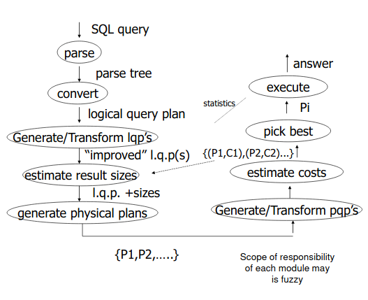

- Table of Contents
{:toc}


## Lecture 1

- [SQL Review](review/)

## Lecture 2 - Database Storage and Hardware Design

- Different storage types used by databases
    - Typically cost is higher and amount of storage is lower the faster it is
    - CPU-level cache typically isn't controlled by the software, so the DB
      can't do much optimization around it
    - RAM is utilized by DB, but can't guarantee transactions due to volatility
    - SSD, HDD, Tape, etc are non-volatile and can guarantee transactions


Peculiarities of storage and algorithms

- most storage is accessible via block-based access (via kernel, i.e. block
  device)
- not just pulling the bytes we need - taking big chunks.
- clustering (for hard disks):
    - cost is lower for consecutive blocks.
- sequential read times have increased immensely
    - minimum access time to first byte has not decreased propotionally

Ex: 2-phase merge sort

- Pass 1: Read section by section into buffer, sort all data, write
  sorted section to file
- 2nd pass: file pointers to all previously written files, read block from each
  file write in sorted order out to new file.
- Assume RAM buffer of size $$M$$
- Block size of $$B$
- Number of block reads = $$M/B$$
- File sections: $$N / M / B$$

With ram buffer of size $$M$$ can sort up to $$M^2 / B$$ records (at least one
block from each ram buffer)

Horizontal Placement of SQL data in blocks

- row oriented - tuples packed together in blocks
    - improve total table scan time
- for deletions, clear the block, add a "mark" (bit?) for deletion
- for additions to a sorted table by a key, leave a pointer on the block where
  it should exist to the new record (only applies on sorted files)

## Lecture 3 - Indexing

_Given condition on attribute, find the qualified records_

- Indexing is a trick to speed up the search for attributes with a particular
  value
  - Conditions may include operations like `>`, `<`, `>=`, `<=`, etc

- Different types of indexes, each need evaluation
  - time for access, insert, delete, or disk space

### Topics

- Conventional (Traditional) Indexes
- B-Trees
- Hashing Schemes

### Terms and Distinctions

- _Primary Index_ - index on the attributes which determines sequencing of the
  table.
    - can tell if value exists without accessing a file
    - easier access to overflow records (refer to previous lecture)
    - required for secondary index
- _Secondary Index_ - indexes on any other attribute
    - sparse index takes lest space.
    - better insertions
- _Dense Index_ - every value of the indexed attribute appears in the index
- _Sparse Index_ - many values do not appear


Can have multi-level indexes
- index the index!
- generally, two-level index is sufficient, more is rare

Pointers - a block pointer, value of record attribute, then a value representing
the block and/or record location.
- Block pointers cannot be record identifiers

What if a key isn't unique?

- Deletion from a dense primary index with no duplicate is the same way as a
  sequential file - leave blank space
- Deletion from a sparse index, similar approach, but might not have to delete
  anything.
    - or, simply leave it, just change the pointer without changing any blocks
      - must assume the algorithm doesn't assume a value exists just because it
        exists in the index.

Insertion in sparse index: if no new blocked is created for the key, do nothing
 - otherwise, create an overflow record
 - reorganize periodically

Duplicate values and secondary indexes

- option 1: index entry to each tuple. not very efficient
- option 2: index on unique values, then have blocks of "buckets" containing
  sequential pointers to duplicate values


Why bucket+record pointers is useful
- enabled processing of queries working with pointers only
- common technique in information retrieval
- with buckets and record pointers, can simply do set intersection of record
  pointers in order to answer query
  - read less data blocks

### B+Trees

- Give up on sequential records, try to achieve balance instead
  - "node" and "block" are equivalent in lecture
  - node with three values $$j, k, l$$, 4 pointers ($$n+1$$)
    - $$ p1 < j $$
    - $$ j >= p2 > k $$
    - $$ k >= p3 > l $$
    - $$ l >= p4 $$
- non-root nodes must be at least half-full
  - non-leaf node $$ \lceil \frac{n+1}{2} \rceil$$ pointers
  - leaf node: $$ \lfloor \frac{n+1}{2} \rfloor $$.
- bounded number of block access in the index based on the depth of the tree


## Lecture 4 - Indexing Pt. 2

- Coalescing and deletes in B+Trees are not always implemented.
- Play with
  [https://www.cs.usfca.edu/~galles/visualization/BPlusTree.html](https://www.cs.usfca.edu/~galles/visualization/BPlusTree.html)
  for visualizations.
- Important to note again why B+ trees are important: guaranteed bound on block
  accesses to get to leaf node

### Hashing Schemes

- hashing returns the address of bucket
- In the case of key collisions, the bucket is a linked list
- compute the table location as $$ hash(key) % buckets $$
- sorting in buckets only if cpu time for lookup is critical and inserts+deletes
  are not frequent
- in DBs, hashing limited by data blocks to limit lookup accesses (different
  from array-based hash map in languages like Java)
  - entries in the buckets (blocks) have the key and a pointer to the
    corresponding data location.
  - if a bucket overflows too much, there is a pointer to an overflow block.
- Rule of thumb: keep space utilization between 50% and 80% to limit overflow
  creations.
    - $$ < 50%$$ wasting space
    - $$ > 80%$$ slow down lookups due to overflow buckets

- How to cope with growth?
  - Overflow blocks make it slow to lookup
  - re-hashing wastes lots of time

### Extensible Hashing

- Extensible Hashing: 2 ideas
  - use $$i$$ of $$b$$ bits which are output by the hash function.
  - use a directory to point to buckets
    - directory fits in main memory
    - points to buckets which contains full keys+pointer
- When you overflow a bucket, increase the number of bits, $$i$$ that the hashed
  values agree on, then create a new directory table without modifying the
  original blocks, and placing the new block from the block where records
  overflowed with the transferred records.
- Strengths
  - Can handle growing files
    - less wasted space
    - no full reorganization
- Weaknesses
  - Reorganizing table can be expensive
  - Indirection, not bad if everything in main memory
  - directories double in size

### Linear Hashing

- keep same idea of using low order bits from hash value
- file grows in linear fashion
- Variables
  - keys of $$b$$ bits
  - hash bits of $$i$$
  - n keys in data blocks (again)
  - $$m$$ to track maximum used block.
- Rule

$$ h(k)[i] \leq m \text{ bucket } h(k)[i]$$
- else
$$ h(k)[i] - 2^{i-1}$$

- When to expand the file?
   - keep track of $$ \frac{\text{# used slots (incl. overflow)}}{\text{# total slots in primary buckets}}$$
   - when above a threshold, increase $$m$$, as well as $$i$$ when $$ m = 2^i $$

- Strengths
  - can handle growing files
  - less wasted space
  - no full reogranization

## Lecture 5 - Indexing Pt. 3 - Hashing

- Indexing vs hashing
  - Hashing is a good to probe for a specific key
  - Indexing (b+tree) is good for range searches
- DBs tend to have tree-based indices because it makes it easy to implement
  predicates with greater, less, leq (less than eq.), geq
- Traditional DBs don't really let you define the types of indexes (b-tree/hash)
  in SQL
  - Some systems allow configuration parameters to change implementation
- Multi-key indices to speed up queries with conditions on multiple attributes
  - Strategy for multi-condition queries with single index on each attribute
    - use one index and get tuples to satisfy cond1
      - iterate over list from above result to return correct set
    - another strategy
      - multi-index, find set of results satisfying both, then perform set
        intersection logic to get result (AND) condition.
  - Instead, structure keys as trees.
    - At the top level, sort by first key
      - all tuples underneath top-level attribute in a group, have same
        attribute value for top-level key.


### Bitmap Indices

- Heavily used in OLAP (online analytics)
- Assume that tuples are in some order that each index sees globally
- e.g. each index attribute value has a bitmap (string of 1's and 0's)
e.g. given a table

| name | dep | year |
| aaron | suits | 4 |
| helen | pens | 3 |
| jack| PCs | 4 |
| yannis | pens | 1 |


then our bitmaps indices would be

| dept  | bitmap |
| PCs | 0010 |
| pens | 0101 |
| suits | 1000 |

| year  | bitmap |
| 1 | 0001 |
| 2 | 0000 |
| 3 | 0100 |
| 4 | 1010 |

- unfortunate, bitmaps require a lot of space
- increase in size w/ number of tuples
- for 1B tuples, 1B / 8 bytes of space * number of values for the index
- can try to compress bitmaps! (mostly 0's)
- Compression
  - naive solution for bitmap requires $$n*m$$ bits
  - in reality, across the whole map there is only $$n$$ 1's
  - compress bitmap to $$2nlog(m)$$
    - $$n$$ is the number of tuples
    - $$m$$ is the number of distinct values.
  - e.g. 00011010 compresses to 301
    - 3 0's until first 1
    - 0 0's until 2nd 1
    - 1 0 until 3rd 1
  - further compress the encoding of the bitmap
    - 301 binary representation (digit-wise)
      - 11 (2 bits, 10 in binary)
      - 0 (1 bits)
      - 1 (1 bits)
      - end length scheme with 0, fill # of bits before - 1 with 1's
        - eg. encode `10010` -> _11110_**10010**
      - 0's act as delimiters
    - Represent this as
      - _10_**11**_0_**0**_0_**1**

Bitmap example 2:

Pens bitmap: `01000001`
Sequence: `[1, 5]`
Encoding: _0_**1**_110_**101**

- Handling Insertions and Deletions
  - Assertions, assume happens in order (nothing to do)
  - Deletions: do nothing, leave record and 0-out bitmap
  - Insertions: if tuple _t_ with value _v_ is inserted, add one more
    run in _v_'s sequence.

#### Proving 2*nlog(m)

- n * m bits
- will find exactly $$n$$ runs. (Across all bitmaps)
- why is the average run length $$2*log(m)$$?
  - $$n$$ bits per bitmap - expect average $$ \frac{n}{m} $$
  - n / (n / m) -> size of conceptual bitmap divided by the average run size -> $$m$$


## Lecture 6 - Query Processing

- A query processor turns user queries and data modification commands into a
  query plan
  - **query plan** is a sequence of operations on the database
- Decisions taken by a query processor
  - which of the algebraically equivalent forms of a query will lead to
    the most efficient algorithm?
  - for each algebraic operator, what algorithm should we use to run the
    operator
  - how should the operators pass data from one to the other?

### Example

```sql
SELECT B, D
FROM R,S
WHERE R.A = "c" and S.E = 2 AND R.C = S.C
```

How to execute this query?
- idea 1:
  - scan relations
  - do a cartesian product
  - select tuples
  - do projection

Use relational algebra to describe the plan: e.g.

- $$ \Pi^{FLY}_{B,D}[\sigma^{FLY}_{R.A="c" \land S.E=2 \land R.C=S.C}(R^{SCAN} \times S^{SCAN})] $$

Above is very inefficient...

- Plan 2: Instead of a full scan with a cartesian product, we can do something
different:
  - scan each table and only include rows matching the predicates in the result
  - perform natural hash join on reduced tables
- Plan 3: use indexes of each table
  - use R.A index to select tuples of `R.A = "c"`
  -  for each `R.C` value found, use `S.C` index to find matching joins
  - eliminate join tuples where `S.E != 2`
  - projection


- From query to optimal query plan
  - complex
  - algebra based logical and physical plans
  - transformations
  - may need to evaluate alternatives
- Issues in query planning:
  - generating plans
    - employ efficient primitives to compute these operations
  - estimate cost of plans
  - "smart"  search of possible plans



### Algebraic Operators

#### Predicates ($$\sigma$$)

- Select tuples of $$R$$ that satisfy condition $$C$$: $$\sigma^R_C $$
  - may contain multiple condition with AND/OR
  - may be of the for `attr1 = value` or `attr1 = attr2`
  - other operators like $$<,>,\neq,\text{LIKE}$$

#### Projections (SET vs BAG): $$\Pi$$

- $$\Pi_{a_1...a_n}^{R}$$:
  - returns a table that has only attributes $$a_1$$,...,$$a_n$$ of $$R$$
  - Set version: no duplicate tuples in the result
  - Bag version: allows duplicates

#### Cartesian Product: $$\times$$

- $$\times$$:
  - the schema is the combination of all attributes of $$R$$ and $$S$$
  - for every tuple in $$R$$ is matched to all tuples of $$S$$
  - if there are any attribute name collisions, prefix with the `<Table_Name>.`

### Algebraic Operators: A Bag Version

- _Union of R and S_:  a tuple t is in the result as many times as the sum of
  the number of it is in R, plus the times it is in S.
- _Intersection of R and S_: A tuple t is in the result the minimum number of
  time it is in R and S.
- _Difference of R and S_ A tuple t is in the result the number of times it is
  in R minus the number if times it is in S.
- $$\delta(R)$$ converts the bag $$R$$ into a set.

### The Extended Projection

- Extend the relation projection $$\pi_A$$:
  - the attribute list may include $$x\rightarrow y$$ in the list to indicate
    the attribute x is renamed to y
  - Arithmetic, string operators, and scalar function on attributes are allowed
    - e.g. $$a+b\rightarrow x$$ means teh sum of a and b is renamed to x.
    - e.g. $$c||d\rightarrow y$$ concatenates teh result of c and d into a new
      attribute named y.
  - Note these are available only for **scalar** functions - not aggregations
    (like AVERAGE, COUNT).
  - results are generated by computing a _new_ tuple with any renamed attributes
    and functions applied.

Example

```sql
SELECT 2*A, as D, B, C as CPRIME
FROM T
```

would be converted into

$$\pi_{2A\rightarrow D,B,C\rightarrow CPRIME} T$$

### Cartesian Products -> Joins

- Product of R and S ($$R\times S$$)
  - if an attribute named _a_ is found in both schemas, the rename by prefix
  - if a tuple r is found n times in _R_ and a tuple _s_ is found _m_ times in
    _S_ then the product contains _nm_ instances of tuples _rs_.
- Joins
  - **Natural Joins**: $$R \bowtie S\rightarrow \pi_{A}\sigma_{C}(R\times S)$$
    - C is a condition that equates common attributes
    - A is the concatenated list of attributes of _R_ and _S_ with no duplicates
  - **Theta Join**
    - arbitrary condition that involves multiple attributes

Example of a theta join

```sql
SELECT T.A
FROM T,S
WHERE T.A=S.B
```

equates to

$$\pi_{T.A} (T \theta_{T.A=S.B} S)$$

### Grouping and Aggregation: $$\gamma$$

- $$\gamma_{\text{groupByList};\text{aggrFn1}\rightarrow \text{attr1}} $$
- Conceptually, grouping leads to nested tables and is immediately followed by
  functions that aggregate the nested table.
- example: $$\gamma_{\text{dept.;AVG(Salary)}\rightarrow\text{AvgSal},\text{SUM(Salary)}\rightarrow\text{SalaryExp}}$$

Example 2:

```sql
SELECT Dept, AVG(Salary) AS AvgSal
FROM Employee
GROUP BY Dept
HAVING SUM(Salary) > 100
```

$$ \pi_{\text{Dept,AvgSal}} \sigma_{\text{SumSal > 100}}\gamma_{\text{Dept,AVG(SALARY)->AvgSal,SUM(Salary)->SumSal}}(\text{Employee}) $$

### Sorting and Lists

- SQL and algebra results are ordered
- Could be non-deterministic or dictated by SQL's `ORDER BY` ($$\tau$$)
- A result of algebraic expression o(exp) is ordered if
  - o is $$\tau$$
  - if o retains ordering of exp and exp is ordered
    - depends on implementation !
  - if o creates ordering
- consider leaf of tree may be scan (R)

## Lecture 6 - Relational Algebra Optimization

- Work with algebras - transform one expression to another equivalent
  - simple example $$x(y + z) = xy + xz$$
- Need to determine which are "good" transformations

### Commutativity and Associativity

 - Commutative: $$R \times S = S \times R$$
 - Associative: $$ R \times  (S \times T) = (R \times S) \times T $$
 - Natural join ($$\bowtie$$) is also commutative and associative

- Commutative
  - cartesian product: $$\times$$
  - natural join/theta join: $$\bowtie$$
  - union: $$\cup$$
  - intersection: $$\cap$$
- Associative
  - cartesian product: $$\times$$
  - natural join/theta join: $$\bowtie$$
  - union: $$\cup$$
  - intersection: $$\cap$$

### Rewriting of algebraic expressions for logical connectives

instructor not clear on this section. refer to slides

### Pushing Selection Through Binary Operators: Union and Difference

- $$ (R \cup S) \sigma_\text{cond} = \sigma_\text{cond} R \cup \sigma_\text{cond} S $$
- $$ (R - S) \sigma_\text{cond} = (\sigma_\text{cond} R) - (\sigma_\text{cond} S) $$


### Pushing Selection Through Cartesian Product and Join

- $$ (R \times S) \sigma_\text{cond} = R \times (\sigma_\text{cond} S)$$
- $$ (R \bowtie S) \sigma_\text{cond} = R \bowtie (\sigma_\text{cond} S)$$

### Pushing Projections Through Binary Operators

- $$(R \cup S) \pi_A = (\pi_A R)\cup(\pi_A S)$$

### Pushing Projections Through Join and Cartesian Product

- $$(R\times S)\pi_A = ((R\pi_B) \times (S\pi_B))\pi_A$$
  - same for natural join

### Deriving some rules

- $$\sigma_{p\land q} (R \bowtie S) = \sigma_p R \bowtie \sigma_q S$$
- see more examples in slides

###  What are always "good" transformations?

- Some transformations are always good
- others we do because it creates alternative (new) transformations which can also
be efficient.

### Examples

- $$\sigma_{p1\wedge p2}(R) \rightarrow \sigma_{p1} (\sigma_{p2}(R))$$
  - not always good because conditions depend on index
- $$\sigma_p(R\bowtie S) \rightarrow (\sigma_p (R)) \bowtie S$$
  - Usually good because joins are expensive, good to eliminate first.

### The Bottom Line

- No transformation is _always_ good
- Usualy good:
  - early selections
  - elimination of cartesian products
  - elimination of redundant subexpressions
- many transformations can lead to "promising" plans
  - communicating/rearranging joins
  - in practive, too combinatorially explosive to handle a re-writing


### Algorithms for Relation Operators

- 3 Primary techniques
  - sorting
  - hashing
  - indexing
- 3 degrees of difficulty
  - data small enough to fit in memory
  - too large to fit in main memory, but small enough to be handled by a two-pass algorithm
  - so large that two-pass methods have to be generalized to multi-pass

- Dominant cost of operators running on disk
  - no. of disk block that must be read/written to execute query plan

### Pipelining can greatly reduce cost.

- each operator can scan through file with tuples
  - check condition (select) with sigma
  - project with pi
  - intermediate files between steps
  - open/close between each
  - (this is very very slow)
- Instead, pipeline operators while opening data files
  - pass output from one operator into the next operator
  - no intermediate files


### Iteration Join

- $$ R1 \bowtie R2 $$ on a common attribute C
- Least efficient _iteration join_

```python
for r in R1:
  for s in R2:
    if r.C = s.C, output (r, s)
```

- merge join (conceptual)
  - if R1 and R2 not sorted by C, sort them
    - dual pointer algorithm
      - move smaller value pointer to next tuple
      - emitting pairs until hitting the end of the smaller table
      - however, slightly more complex, as you need to keep track of
        sets of equivalent values
          - need to output all combinations of tuples
  - O(n+m)