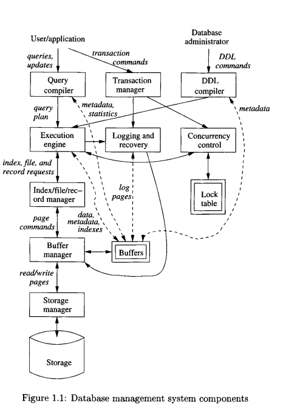

- **Tables** are _relations_
- **Attributes** are _columns_
- **Schema** is the name of the relation _and_ the set of attributes
    - Take the ordering of items defined in a schema to be the _standard order_. i.e. `Movies(title, year, length, genre)`
- **Tuple** is a _row_ of a relation
    - Ordering must be consistent with _schema_
- **Domain** is the data type of a _attribute_
    - Must be a an elementary type (string, integer, double, etc)
- **Instance of a relation** is the set of tuples within
- **Key** is a set of attributes in a relation where we do not allow two of those tuples in the instance of a relation to have the same values for _all attributes of the key_ 

**ACID**
- _Atomicity_
- _Consistency_
- _Isolation_
- _Durability_

- Structured (relational) vs semi-structured (XML)

Overview of DBMS Components



**SQL Review**

Create a table

```sql
CREATE TABLE Movies (
        title      CHAR(1OO),
        year       INT,
        length     INT,
        genre      CHAR(10),
        studioName CHAR(30),
        producerC# INT
);
```

Delete a table

```sql
DROP TABLE Movies;
```

Add a column

```sql
ALTER TABLE Movies ADD awards INT;
```

Remove a column

```sql
ALTER TABLE Movies DROP awards;
```

Set a default value when adding a column

```sql
ALTER TABLE Movies ADD awards INT DEFAULT 0;
```

Defining primary keys with `PRIMARY KEY` (1 attribute) or `UNIQUE` (multiple attributes)

```sql
CREATE TABLE MovieStar (
    name      CHAR(30) PRIMARY KEY,
    address   VARCHAR(255),
    gender    CHAR(l),
    birthdate DATE
);
-- OR
CREATE TABLE MovieStar (
    name      CHAR(30),
    address   VARCHAR(255),
    gender    CHAR(l),
    birthdate DATE,
    PRIMARY KEY (name)
);
-- OR
CREATE TABLE Movies (
        title      CHAR(1OO),
        year       INT,
        length     INT,
        genre      CHAR(10),
        studioName CHAR(30),
        producerC INT,
        PRIMARY KEY (title, year)
);
```
Two tuples in a relation cannot agree on all of the attributes in a
set of the primary keys, unless one of them is `NULL`

- `PRIMARY KEY` disallows `NULL`
- `UNIQUE` allows `NULL`

**Joins**

- _Natural Join_ where two relations with exist with the same attributes are matched with one another


| U |
| A | B | C |
|---|---|---|
| 1 | 2 | 3 |
| 4 | 5 | 6 |
| 7 | 8 | 9 |

| V |
| B | C | D |
|---|---|---|
| 2 | 3 | 10 |
| 2 | 3 | 11 |
| 6 | 7 | 12 |

The natural join of `U` and `V` is

| A | B | C | D |
|-|-|-|-|
| 1 | 2 | 3 | 10 |
| 1 | 2 | 3 | 11 |

The concept of an **Outer Join** is where the dangling (non matching) tuples in
a relation are included in the join with the values in the left/right attributes
which don't match filled in as `NULL`

A **left outer join** or a **right outer join** is where the result of the join
only includes the `NULL` for the tuples in the table whose type of join it is.

FOr example, a `LEFT OUTER JOIN` statement for U and V means the non
matching tuples for table U (the left argument) would have the attribute on the join (D) left as `NULL`

| A | B | C | D |
|-|-|-|-|
| 1 | 2 | 3 | 10 |
| 1 | 2 | 3 | 11 |
| 4 | 5 | 6 | `NULL` |
| 7 | 8 | 9 | `NULL` |

Similarly, the `RIGHT OUTER JOIN` would not have the tuples `(4, 5, 6 NULL)` or `7, 8, 9, NULL)`. It would include though `(NULL, 6, 7, 12)`

**`[NOT] LIKE`**

