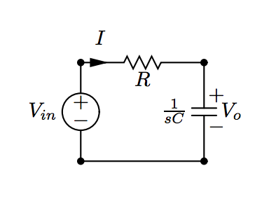
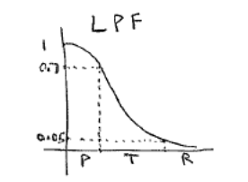

These notes are for the version of the course taught in the spring of 2016 by professor Pedapulla Sannuti

- [Syllabus Spring 2016](../Syllabus-222-S2016.pdf)

## Lecture 1 - January 19th 2016

- [Review of Principles of EE 1](../Review-of-basics-of-EEI.pdf)

We introduce a new notation we'll call the "Laplace Domain". It is similar to the phasor domain from PEE 1. It's very simple.

We introduce the variable $$s$$.

> $$ s = j\omega $$

We solve everything the same way as we previously did. But now we just replace every $$j\omega$$ with $$s$$.

It's that simple!

## Bode Plots and Filters

-------

**[How to Bode Plot - A Beginner's Guide](../how-to-bode-plot/)**

See below for professor's PDF notes on Bode plots and filters.

- [Notes on Bode Plots](../Bode-plots.pdf)
- [Notes on Filters](../Filters-Notes-S2016.pdf)

**Basic Introduction to Fourier Transforms of a Time Domain Signal**

- Fourier and Laplace revolutionized many fields by introducing the concept that **any signal can be thought of as being composed by a number (finite or infinite) of sinusoidal signal of different frequencies, amplitudes, and phase angles**.

That is the sinusoidal signals that compose a signal $$x(t)$$ are called the **frequency components** of $$x(t)$$. If a sinal has a countably finite or infinite number of frequency components, then

> $$ x(t) = \sum\limits_{k=1}^N X_kcos(\omega_kt + \theta_k) $$

But then what happens when we say that our signal $$x(t)$$ has an infinite number of components? We can turn it into an integral:

> $$ x(t) = \int\limits^{\omega_2}_{\omega_1} X(\omega)\cdot cos(\omega t + \theta(\omega))d\omega $$

We are limited here to say that the frequencies lie within the range $$\omega_1 \text{ to } \omega_2$$.

Let's not worry too much about the math right now.

In the purpose of transmitting signals over the air (think TV, radio, etc..) channels will typically occupy a certain **"band"** of signals.

For our purposes we'll just define a **band** as a **range of frequencies**.

Now these TV and radio **channels will typically be made of many different signals with frequencies that lie within a band** assigned to that channel.

For example the TV channel WABC occupies the band of 765 KHz to 775 KHz. This means that the channels transmissions will be made up of a signal of the frequencies in that range.

A filter itself does almost exactly what you think it would it would do with a signal. It will allow (or disallow) a certain range of frequencies from passing through it.

A somewhat more formal definition:

> A **filter** is basically a circuit that has a **transfer function** between its input and output. The transfer function lets certain frequency components of the input pass through to the output,  while it blocks all other frequency components.

Depending on what a filter allows and disallows through it can be classified with different names.

Right now we will focus on these 4 types of **ideal filters**

1. Low-Pass Filter
  - A filter which will only allow signals with frequencies that are **lower** than a specified $$\omega_0$$
2. High-Pass Filter
  - A filter which will only allow signals with frequencies that are **higher** than a specified $$\omega_0$$ through the filter
3. Band-Pass Filter
  - A filter which will only **allow a certain range (band)** of frequencies between a specified $$\omega_0$$ and $$\omega$$
4. Band-Rejection Filter
  - A filter which will **disallow a certain range (band)** of frequencies between a specified $$\omega_0$$ and $$\omega$$

Please make note of the word **ideal**. Because this means that the filter will definitely pick up (or block) the intended signal.

A non-ideal filter will pick up the intended signal, but possibly some non-intended signals as well. This results in **channel interference**.

Now imagine a normal RC-series circuit where we have a voltage source $$V_{in}$$ in series with a Resistor, R, and Capcitor of capacitance C

Now from this vircuit we can deduce that our transfer function is:

> $$ H(s) = \frac{V_0}{V_{in}} = \frac{\frac{1}{sC}}{R + \frac{1}{sC}} $$

Then we can convert this to the frequency domain

> $$ H(j\omega) = \frac{ 1 }{1 + j\omega RC} $$

This gives us our transfer function based on frequency. This is a ratio between the input and output signals. 

We find that based on different types of filters, these transfer functions will differ.

Now let's take a look at a plot of one of these transfer functions

Here we see 3 different bands of frequencies:

- Pass-band
- Transfer-band
- Rejection-band

When we have higher order (3rd, 4th, 5th) RC circuits, we'll see that the range of frequencies  in the transfer-band decreases.

The smaller the transfer band the **less cross-talk interference**.

## Filters - Terminology

Typically of a transfer function we can represent our transfer function in the phasor domain as

> $$ H(j\omega) = M(\omega) \angle \theta(\omega)$$

We should also note that:

- Power $$\propto \text{voltage}^2$$
- Power transmitted by input to output $$\propto M^2(\omega)$$

At a certain frequency, say $$\omega_m$$ has a maximum possible value of $$M(\omega_m)$$

Then from this we can also say that the **maximum power transferred is $$M^2(\omega_m)$$**

The **half power frequency** is the frequency at which the power transmitted by the input $$\implies M^2(\omega) = \frac{1}{2}M^2(\omega_m)$$

Or, equivalently using a decibel scale, the **half power frequency** $$= 20log_{10}(M(\omega_m)) - 3dB$$

- **Practical Low Pass Filters** if they are properly designed, will have only one _half-power frequency_ or cut-off frequency (denoted by $$\omega_0$$). Then, the **pass-band** of this filter ranges from 0 to $$\omega_c$$
- **Practical High-Pass Filter** For properly designed, ideal high pass filters there is only one cutoff frequency which is then starts at the cutoff frequency and continues to $$\infty$$. However, due to signal degredation and other factors, we can assume high-pass filters are just very large **band-pass filters**
- **Practical Band-Pass Filters** In there there are simply just two cutoff frequencies with a "center" frequency (not necessarily exactly between the two), called the **resonant** frequency.
- **Band-Reject Filters**: For the reject filters we find there are also two half-power frequencies which reject the frequencies between them.

In filters we also have a **time delay** which occurs due to the phase change of the filter (transfer function)

If our input is $$x(t)$$, then our output has a function of $$x(t - t_d)$$, where $$t_d$$ is the time delay.

We can see the exact relationship with phase angle $$\theta$$ by the following:

> $$ x(t-t_d) = Acos(\omega(t-t_d)) = Acos(\omega t - \omega t_d) = Acos(\omega t + \theta) $$

From this we can see that $$\theta = -\omega t_d$$

Or that $$t_d = -\frac{\theta}{\omega}$$

## Transfer Function of a First-Order LPF Op-Amp Circuit

## Designing Filters

**Roll-Off Rate** At the edges of a passband filter, the rectangular shape is an idealized filter response. The slope is infinite. However, in actual circuits we find our transfer functions do not actually provide us with this ideal slope. 

The steeper we can make these slopes the better our filter will tend to be. The slope of the frequency magnitude esponse outside the passband it often called the **gain roll-ff rate**. The **higher the roll-off rate the better**

**Methodology for Filter Design**

First and second-order filters are often cascaded (connected end-to-end) to form what we call a **composite filter**. This means we need to analyze the common first and second-ordr filters.

**Passive filter** circuit (if properly designed) have the advantage of not requiring maintenance and are relatively cheap. However, when passive filters are cascaded, one filter circuit acts as a load to the previous filter. If the loading effect is dominant, the performance of the composite circuit will degenerate.

On the other hand **active filter circuits** do not present any loading problems since Op-amps have very low output impedance and high input impedance. However, the downside here is that active filters require maintenance and are prone to parasitic effects.

**Prototyping and Filter Design**

Typically filters will be designed with units in mind that make them easy to work with. The problem is that not all applications will use these numbers. They need to be **scaled** to their applications.

------------

**See below for a more detailed explanation on cascading**

------------

When we scale a single **active filter circuit** from one function to another. Usually we will want to scale the magitude and frequency up to certain values.

The new scaled frequency and phase will be equal to the original frequency and magnitude multiplied by a constant. We will call

- $$K_m$$ scaled magnitude constant
- $$K_f$$ scaled frequency constant

From this we can then determine how we should modify the filters components (capacitors, resistors, inductors) depending on the scaling we want

To derive these new component values for the magnitude scaling we will use the following equations

- $$R' = K_m\cdot R$$
- $$j\omega L' = j\omega L \cdot K_m $$
- $$\frac{1}{j\omega C'} = \frac{1}{j\omega \frac{C}{K_m}}$$

Then for frequency scaling we get

- $$R' = R$$
- $$j\omega K_f\cdot L' = j\omega L $$
- $$\frac{1}{j\omega K_f\cdot C'} = \frac{1}{j\omega C}$$

From these we get our scaling formulae

- $$R' = K_mR$$
- $$L' = \frac{K_mL}{K_f}$$
- $$C' = \frac{C}{K_mK_f}$$

### Effects of Scaling on a Transfer Function

> $$H(j\omega) = H'(jK_f\omega)$$

> $$H'(j\omega) = H(\frac{j\omega}{K_f})$$

> $$H'(s) = H(\frac{s}{k_f})$$

### Steady State Response of a Circuit

**Voltage over an Inductor**

> $$ V = L\frac{di}{dt} $$

**Current Through an Inductor**

If we use some differential equations to solve for the current through an inductor we get

> $$ i(t) = I_0e^{-(R/L)t}$$ where $$t \geq 0$$

**Current over a Capacitor**

> $$ I = C\frac{dv}{dt} $$

**Voltage over a Capacitor**

If we use some differential equations to solve for the voltage over a capacitor we get

> $$ v(t) = V_0e^{-(t/\tau)} $$ where $$\tau = RC$$ and $$t \geq 0$$

Now we need to use the above information to study the **Step Response** of a circuit

Step Response:

> The response of a circuit to the sudden application of a constant voltage or current source is referred to as the step response of the circuit.

**Step Response of an RL Circuit**

We find that in a basic series RL circuit the current through the circuit is:

> $$ i(t) = \frac{V_s}{R} + (I_0 - \frac{V_s}{R})e^{-(R/L)t} $$

**Step Response of an RC Circuit**

For a basic series RC circuit, the step response is equal to

> $$ V_c = I_s(R) + (V_0 - I_sR)e^{-t/RC} $$

## Intro to Laplace Transforms

A Laplace transform for a function $$f(t)$$ is denoted as:

> $$F(s) = \mathscr{L}\{f(t)\}$$

Where the laplace transform $$L\{f(t)\}$$is defined as:

> $$F(s) = \mathscr{L}\{f(t)\} = \int\limits_0^{\infty} f(t) e^{-st} dt$$

This is called a **unilateral** or **one-sided** laplace transform which extends from 0 to infinity. We will only be dealing with this type of transform.

### The Delta (Impulse) Function

A delta function is characterized as a function which at any point in time, $$t$$, that the amplitude is $$\infty$$, but the duration of the pulse at that point is equal to 0.

Mathematically the impulse function is defined as:

> $$ \int\limits_{-\infty}^{\infty} K\delta (t) dt = K $$

where $$\delta(t) = 0 \text{ for all } t \neq 0$$

In the real world, these electric circuits these types of electric signals don't actually exist, but they come very close, and this mathematical model is useful.

We should note that

> $$ \mathscr{L}\{\delta (t)\} = \int\limits_0^\infty \delta (t) e^{-st} dt = 1 $$

### Table of Useful Laplace Transforms

|Name| $$f(t)$$ | $$\mathscr{L}\{f(t)\} = F(s) $$ |
|Impulse|$$\delta(t)$$ | $$ 1 $$ | 
|Straight Line| $$1$$ | $$\frac{1}{s} $$ |
|Constant| $$k$$ | $$\frac{k}{s} $$ |
|Ramp| $$t$$ | $$\frac{1}{s^2}$$ |
|Exponential| $$e^{-at}$$| $$\frac{1}{s + a} $$|
|Sine| $$sin(\omega t)$$ | $$\frac{\omega}{s^2 + \omega^2} $$ |
|Cosine| $$cos(\omega t)$$ | $$\frac{s}{s^2 + \omega^2}$$|
|Damped Ramp|$$te^{-at}$$|$$\frac{1}{(s+a)^2}$$|
|Damped Sine|$$e^{-at}sin(\omega t)$$|$$\frac{\omega}{(s+a)^2 + \omega^2}$$|
|Damped Cosine|$$e^{-at}cos(\omega t)$$|$$\frac{s + a}{(s+a)^2 + \omega^2}$$|

### Operations on the Laplace Function

**Addition**

Given

- $$\mathscr{L}\{f_1(t)\} = F_1(s)$$
- $$\mathscr{L}\{f_2(t)\} = F_2(s)$$
- $$\mathscr{L}\{f_3(t)\} = F_3(s)$$

Then 

> $$\mathscr{L}\{f_1(t) + f_2(t) - f_3(t)\} = F_1(s) + F_2(s) - F_3(s)$$

**Differentiation**

Given a function $$f(t)$$ where $$\mathscr{L}\{f(t)\} = F(s)$$, then:

> $$ \mathscr{L}\{\frac{df(t)}{dt}\} = sF(s) - F(0) $$

Certain operations in the time domain correspond to multiplications, additions, and divisions in the Laplace domain

Given $$\mathscr{L}\{f(t)\} = F(s) $$

Then 

> $$\mathscr{L}\{\int\limits_0^t f(t)\} = \frac{F(s)}{s} $$

In other words, integration in the time domain of a function corresponds by simply dividing by $$s$$ in the Laplace transform of the function

Given $$\mathscr{L}\{f(t)\} = F(s) $$

Then 

> $$\mathscr{L}\{ e^{-at}f(t)\} = F(s + a) $$

### Inverse Transforms in the Laplace Domain

It is common to evaluate the functions for voltage or current of a into a form like:

> $$ F(s) = \frac{N(s)}{D(s)} =\frac{a_ns^n + a_{n-1}s^{n-1} + \dots + a_1s + a_0}{b_ms^m + b_{m-1}s^{m-1} + \dots + b_1s + b_0}$$

In this case, if the **degree of the polynomial of the denominator is greater**, than the numerator we consider it to be called a **proper rational function** if $$ m > n$$. Otherwise if $$ m \leq n $$ then it is an **improper rational function**

You need to know how to solve partial fractions. Use the links below in case you need a refresher

- [Click Here for a Google Search on Solving Partial Fractions](https://www.google.com/search?q=partial+fractions)
- [Partial Fractions on Khan Academy](https://www.khanacademy.org/math/precalculus/partial-fraction-expans/partial-fraction/v/partial-fraction-expansion-1)
- [Partial Fractions on Paul's Notes](http://tutorial.math.lamar.edu/Classes/CalcII/PartialFractions.aspx)

Now for an example on how an inverse transform from the Laplace domain. Imagine we're given the function:

> $$ F(s) = \frac{96(s+5)(s+12)}{s(s+8)(s+6)} $$

Because the denominator is in the form $$s(s+8)(s+6)$$ we can split this us using partial fractions to be

> $$ F(s) = \frac{K_1}{s} + \frac{K_2}{s+8} + \frac{K_3}{s+6} $$

Now to solve using partial fractions we need to find $$K_1, K_2, K_3$$. First we'll find $$K_1$$. To solve for $$K_1$$ we will multiply everything by $$s$$ and then solve for $$s=0$$

$$s = 0$$

- $$ \frac{96(s+5)(s+12)}{(s+8)(s+6)} = K_1 + \frac{sK_2}{s+8} + \frac{sK_3}{s+6} $$
- $$ \frac{96(0+5)(0+12)}{(0+8)(0+6)} = K_1 + \frac{(0)K_2}{s+8} + \frac{(0)K_3}{s+6} $$

This gives $$K_1 = 120$$

We follow the same procedure for $$K_2$$ and $$K_3$$ except that we will set $$s$$ equal to -8 and -6 respectively. This helps to cancel out the values from the other $$K$$ values.

We get from that that $$K_2 = 48$$ and $$K_3 = -72$$

So finally (after a bit of algebra) we can say

> $$ F(s) = \frac{120}{s} + \frac{48}{s+6} - \frac{72}{s+8} $$

Then we need to perform the inverse Laplace on this to find the original function

> $$ \mathscr{L}^{-1}\bigg\{ \frac{96(s+5)(s+12)}{(s+8)(s+6)} \bigg\} = \mathscr{L}^{-1}\bigg\{ \frac{120}{s} + \frac{48}{s+6} - \frac{72}{s+8} \bigg\} $$

> $$ \mathscr{L}^{-1}\bigg\{ \frac{120}{s} + \frac{48}{s+6} - \frac{72}{s+8} \bigg\} = u(t)(120 + 48e^{-6t} - 72e^{-8t}) $$

## Two-Port Circuits

In this section we're going to explore two port circuits and how we can use them to build circuits.

First we must consider that a two-port ciruit has **4 terminals**. Each terminal has a current running through. Those **current running through the terminals** of the inputs and outputs **must be equal.**

Note the currents, $$i_1, i_2, i_1', i_2'$$. Given the constraint that the input and output current must be equal, we get the relationship:

> $$ i_1 = i_1' $$

> $$ i_2 = i_2' $$

These two-port circuits are typically analyzed in the $$s$$ domain, or frequency domain. Because of this, and the fact that there are actually only two different current values, we simplify the circuit model to the following:

Now because we are now using the $$s$$ domain we can defined a set of equations which show the relationships between the inputs and outputs.

Of the four variables which define this two-port model, we can only define any set of equations for two of variables at a time.

If we wated to combine all of these variables there are six possible ways (or sets) of equations.

| Parameter Names | Equation |
|Impedance| $$ V_1 = z_{11}I_1 + z_{12}I_2 $$ |
|Impedance|$$ V_2 = z_{21}I_1 + z_{22}I_2 $$ |
|Admittance|$$ I_1 = y_{11}V_1 + y_{12}V_2 $$|
|Admittance|$$ I_2 = y_{21}V_1 + y_{22}V_2 $$ |
|Transmission|$$ V_1 = a_{11}V_2 - a_{12}I_2 $$ |
|Transmission|$$ I_1 = a_{21}V_2 - a_{22}I_2 $$ |
|Inverse Transmission|$$ V_2 = b_{11}V_1 - b_{12}I_1 $$ |
|Inverse Transmission|$$ I_2 = b_{21}V_1 - b_{22}I_1 $$ |
|Hybrid|$$ V_1 = h_{11}I_1 + h_{12}V_2 $$ |
|Hybrid|$$ I_2 = h_{21}I_1 + h_{22}V_2 $$ |
|Inverse Hybrid|$$ V_1 = g_{11}V_1 + g_{12}I_2 $$ |
|Inverse Hybrid|$$ I_2 = g_{21}V_1 + g_{22}I_2 $$ |

Notice how for each set of equations there are four different constants. These constants for the entire two port circuit are all called the **parameters** of the circuit.

**So then how do we solve for these parameters?**
 
That's a complicated question, but we'll start off easy. First take the first set of equations with the $$z$$ parameters. In order to solve for these parameters we can evaluate for each $$z$$ if we set the $$I_1$$ or $$I_2$$ variable to 0.

If we set the those current to 0 and solve for each of the parameters this will give us the solution to the circuit.

If we wanted to define these different parameters: 

- $$z_{11}$$ is the impednance when going into port 1 with port 2 as open (incomplete circuit, no current)
- $$z_{12}$$ is called the **transfer impedance**. It is a ratio of the port 1 voltage to port 2 current when port 1 is open (no current into port 1)
- $$z_{21}$$ is another **transfer impedance**. It is the ratio of port 2 voltage to the port 1 current when port 2 is open.
- $$z_{22}$$ is the impedance seen loking into port 2 when port 1 is open.

This means that any of these parameters can be calculated by simply opening one of the ports and measuring the ratio of Voltage to current of the other port, and then the transfer impedance by calculating the open port voltage by the closed port current.

Note that each of the $$z$$ parameters defined an impedance. Not all of the parameters from each of the equations define impedances. Some define **admittances** which has a unit of $$\frac{1}{\Omega}$$. There are also parameters which don't define and impedance or an admittance. They are simply a ratio of two voltages or currents.

A full set for all parameters is below.

The process of solving these circuits is simple. You just need to set the different input variables to 0 (current, voltage), then solve for the circuit to determine the parameter values.

The hardest part is just remembering which parameters belong to which equations.

## Balanced Three-Phase Circuits

These three phase circuits are required in typical power transfer systems because the power companies need to ensure that the RMS voltage on the line does not change no matter what the impedance load is on the circuit.

Three phase circuits help us accomplish this.

Typically a three-phase system will carry thee different sinusoidal electrical signals. We name the different lines (or signals), **a**, **b**, and **c**.

Each of the lines carries the exact same RMS voltage, however the phase of each line is **120 degrees** offset from one another.

We also consider the signal of line **a** to have a phase of **zero degrees**. This means that the b and c-lines will have phases of +120 degrees or -120 degrees.

A **positive phase sequence** means that the c-line **leads** by 120 degrees over the a-line, and the b-lines **lags** by 120 degrees from the a-line.

A **negative phase sequence** means that the b-line **leads** by 120 degrees over the a-line, and the c-line **lags** by 120 degrees from the a-line.

An important property of these three-phase systems is that because they are offset from one another, if we add the sum total of their signals together, it should always be zero.

**Three-Phase Sources**

A three phase system will have three different (yet nearly identical) voltage sources. Typically they are arranged in a Wye (Y) or a Delta ($$\Delta$$) pattern.

The impedances and resistances from each source are due to the internal resistance of the source. We'll call the total of this impedance $$Z_g$$. Because the system is a balanced three-phase system, the individual sources all have impedances $$Z_{ga} = Z_{gb} = Z_{gc} $$

There is also an impedance imposed by the line itself, $$Z_1$$, where each line has a line impedance $$Z_{1a} = Z_{1b} = Z_{1c}$$.

And lastly the load impedances denotes as $$Z_A = Z_B = Z_C$$. Each line has a load impedance equal to the other load impedances.

If we were to draw a circuit with this model is would look like: 

Note the **neutral** line with impedance $$Z_0$$. The nodes at which this line are connected both have a node-voltage of **zero**. This means that neither location has a potential higher than the other. Thus the current through that particular branch is 0.

Another note, $$Z_\phi$$ is the sum total impedance of internal + line + load.

**Line-to-Line vs Line-to-Neutral Voltages**

To calculate the Line to line voltages we should first look at the relationship to the netrual line voltage.

$$V_{AB} = V_{AN} - A_{BN} $$

$$V_{BC} = V_{BN} - A_{CN} $$

$$V_{CA} = V_{CN} - A_{AN} $$

If we assume that there is then a **positive phase sequence**, then the voltages of each are equal to:

$$ V_{AN} = V_\phi\angle 0^\circ $$

$$ V_{BN} = V_\phi\angle -120^\circ $$

$$ V_{CN} = V_\phi\angle +120^\circ $$

Using this information we can calculate the line to line voltages.

Example: 

$$V_{AB} = V_{AN} - A_{BN} = V_\phi\angle 0^\circ - V_\phi\angle -120^\circ = \sqrt{3}V_\phi\angle 30^\circ $$  

After the analysis of the other two lines we get:

$$ V_{AB} = \sqrt{3}V_\phi\angle +30^\circ $$

$$ V_{BC} = \sqrt{3}V_\phi\angle -90^\circ $$

$$ V_{CA} = \sqrt{3}V_\phi\angle +150^\circ $$

